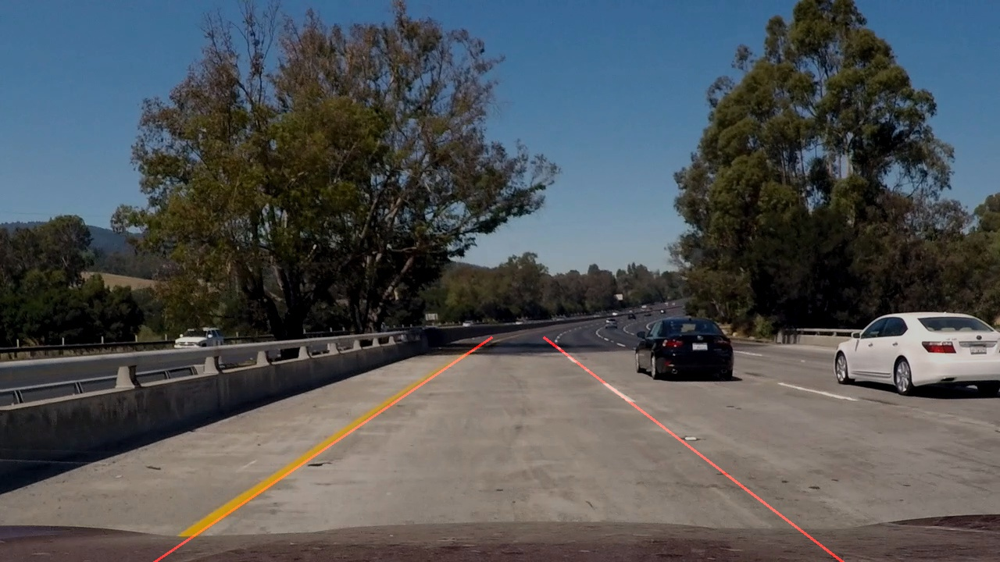

# **Project 1. Finding Lane Lines on the Road** 

Overview
---

An application was developped to detect lane lines in images using Python and OpenCV. The method was validated using images and video clips. I have included the [code](P1.ipynb) for detials of the experiment, and a [write up](writeup.md) summarizing the project and lessons learned. 
